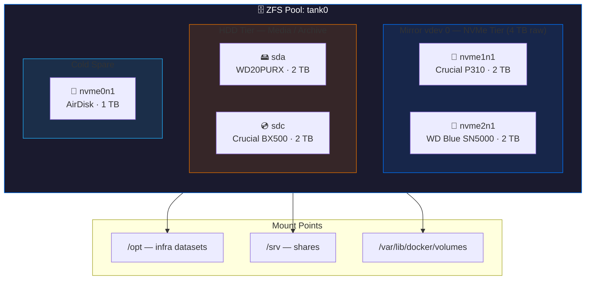
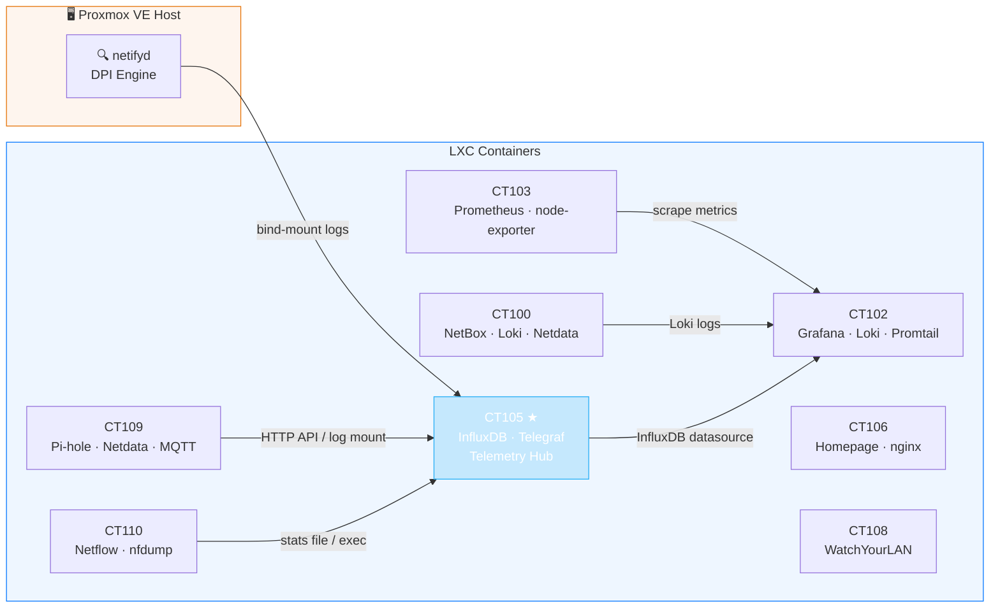
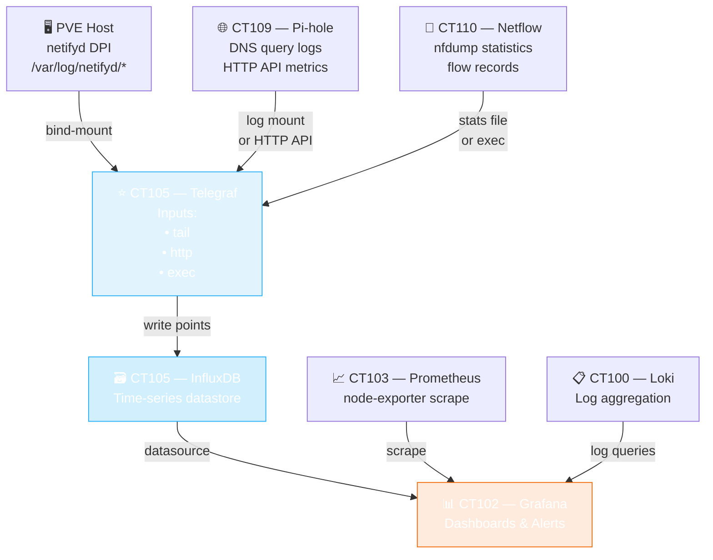
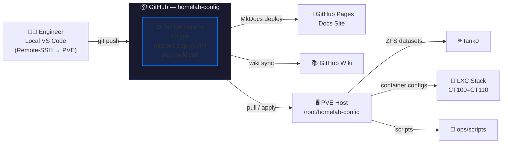

 <div align="center">

# 🏠 homelab-config


> **Infrastructure-as-Code for a production-grade homelab.**
> ZFS-tiered storage · Proxmox LXC/CT orchestration · Full-stack observability · GitOps-driven automation.

[📖 Docs Site](https://jcasnellie69.github.io/homelab-config) · [🗂 Artifacts Index](docs/artifacts-index.md) · [📡 Telemetry Pipeline](docs/telemetry-pipeline.md) · [🤝 Contributing](CONTRIBUTING.md)

</div>

---

## 📋 Table of Contents

- [Overview](#-overview)
- [ZFS Storage Pool — tank0](#-zfs-storage-pool--tank0)
  - [Hardware Devices](#hardware-devices)
  - [Pool Topology](#pool-topology)
  - [Dataset Layout](#dataset-layout)
- [Container Infrastructure](#-container-infrastructure)
  - [Service Map](#service-map)
- [Observability Stack](#-observability-stack)
  - [Telemetry Pipeline](#telemetry-pipeline)
  - [Service Placement Matrix](#service-placement-matrix)
- [GitOps Workflow](#-gitops-workflow)
- [Backup Strategy](#-backup-strategy)
- [KPI Monitoring](#-kpi-monitoring)
- [Scripts Inventory](#-scripts-inventory)
- [Next Steps](#-next-steps)
- [Maintainer](#-maintainer)

---

## 🔭 Overview

This repository is the **single source of truth** for all homelab infrastructure configuration.
It covers everything from raw storage topology to container orchestration, telemetry ingestion,
and automated GitOps pipelines — all documented, version-controlled, and reproducible.

| Layer | Technology | Purpose |
|---|---|---|
| **Hypervisor** | Proxmox VE | LXC containers + VM host |
| **Storage** | ZFS (`tank0`) | Mirrored NVMe + HDD tiered pool |
| **Orchestration** | Docker / LXC | Service containers |
| **Observability** | Grafana · InfluxDB · Prometheus | Metrics, logs, dashboards |
| **DNS / Network** | Pi-hole · Netify DPI · Netflow | Traffic analysis & filtering |
| **GitOps** | GitHub Actions + MkDocs | Automated docs deploy & CI |
| **Config Mgmt** | This repo (`homelab-config`) | IaC, scripts, runbooks, artifacts |

---

## 💾 ZFS Storage Pool — `tank0`

> **Redundancy:** Mirrored vdevs (RAID-1 equivalent)
> **Tiering:** NVMe SSDs for latency-sensitive workloads · HDDs for media/archive · USB for cold backup

### Hardware Devices

| Device | Type | Model | Capacity | Role |
|---|---|---|---|---|
| `nvme1n1` | NVMe SSD | Crucial P310 CT2000P310SSD8 | 2 TB | Primary high-speed |
| `nvme2n1` | NVMe SSD | WD Blue SN5000 | 2 TB | Mirror of nvme1n1 |
| `sda` | HDD | WDC WD20PURX | 2 TB | Media / archive tier |
| `sdc` | SSD | Crucial BX500 CT2000BX500SSD1 | 2 TB | General use / staging |
| `sdb` | HDD | Seagate ST1000VX001 | 1 TB | OS boot (Linux) |
| `nvme0n1` | NVMe SSD | AirDisk 1TB SSD | 1 TB | ZFS cold spare |

### Pool Topology



### Dataset Layout

```
tank0
├── /opt/
│   ├── baseOS                  ← base OS overlays
│   ├── business                ← business workloads  📸 snapshots enabled
│   └── infra/
│       ├── application         ← app containers
│       ├── automation          ← cron / scripts      📸 snapshots enabled
│       ├── development         ← dev environments
│       ├── language            ← runtime envs (Python, Node, Go…)
│       ├── network             ← network tooling
│       ├── observability       ← monitoring stack
│       ├── output              ← rendered artefacts / exports
│       ├── security            ← certs, secrets mgmt
│       ├── storage             ← storage services     📸 snapshots enabled
│       ├── utility             ← general utilities
│       ├── virtualization      ← VM / container data
│       └── web                 ← web services
├── /opt/user/
│   ├── configs                 ← user-level configs   📸 snapshots enabled
│   └── ux                      ← user experience layer
├── /srv/
│   └── shares                  ← NAS / SMB shares
└── /var/lib/docker/volumes     ← Docker volume mount (tank0/docker-volumes)
```

---

## 🐳 Container Infrastructure

### Service Map



---

## 📡 Observability Stack

### Telemetry Pipeline



### Service Placement Matrix

| CT | Role | Key Services | Required | Notes |
|---|---|---|:---:|---|
| 100 | NetBox · Loki · Netdata | netbox, loki, netdata | ✅ | Telegraf not required |
| 102 | Grafana · Loki · Promtail | grafana, loki, promtail | ✅ | Telegraf disabled |
| 103 | Prometheus server | prometheus, node-exporter | ✅ | Telegraf optional |
| **105** | **Telemetry Hub** ★ | **influxdb, telegraf, loki, promtail** | ✅ | Only Telegraf → InfluxDB |
| 106 | Homepage · nginx | homepage, nginx | ✅ | No telemetry agent |
| 108 | WatchYourLAN | watchyourlan | ✅ | No exporter needed |
| 109 | Pi-hole · Netdata · MQTT | pihole-FTL, netdata, wa-mqtt | ✅ | Feeds CT105 |
| 110 | Netflow Collector | nfdump, nfdump@default | ✅ | Feeds CT105 |
| HOST | Netify DPI Engine | netifyd | ✅ | Logs shipped into CT105 |

---

## 🔄 GitOps Workflow



---

## 🛡️ Backup Strategy

| Method | Scope | Schedule | Storage Target |
|---|---|---|---|
| ZFS Snapshots | `automation`, `configs`, `storage`, `business` | Periodic (cron) | On-pool |
| ZFS Send/Receive | Full pool datasets | On-demand / scheduled | External USB (immutable) |
| Cold Spare | Full pool copy | As-needed | `nvme0n1` AirDisk |
| Tiered offload | CCTV (Tapo), low-priority media | Continuous | HDD tier (`sda`) |

> **Immutability:** External USB targets use ZFS send/receive in read-only mode to prevent accidental overwrites.

---

## 📊 KPI Monitoring

Performance of `tank0` and the full stack is tracked via:

| Signal | Tool | Location |
|---|---|---|
| Pool latency / queue depth | `zpool iostat` | PVE host CLI |
| Device throughput | `iostat` | PVE host CLI |
| Live dashboards | Grafana | CT102 |
| Mirror IO balance | Grafana + InfluxDB | CT102 / CT105 |
| Write latency spikes | Telegraf → InfluxDB alert | CT105 |
| Snapshot storage growth | ZFS `list -t snapshot` | PVE host |
| Disk temp & SMART | Netdata + SMART plugin | CT109 / host |
| DNS / DPI anomalies | Pi-hole + netifyd + CT102 | CT109 / host → CT102 |

---

## 📜 Scripts Inventory

| Script | Location | Purpose |
|---|---|---|
| `hc-master.sh` | `scripts/hc/` | Master health-check orchestrator |
| `hc-storage-zfs.sh` | `scripts/hc/` | ZFS pool & dataset health checks |
| `hc-pve-guests.sh` | `scripts/hc/` | PVE guest (LXC/VM) inventory |
| `hc-netflow-basic.sh` | `scripts/hc/` | Basic netflow collection |
| `hc-artifacts-index.sh` | `scripts/hc/` | Rebuild artifacts index |
| `pve-lxc-systemd-scan.sh` | `scripts/hc/` | Scan LXC systemd service health |
| `dhcp-discovery-collect.sh` | `scripts/dhcp/` | DHCP lease discovery & collection |
| `telemetry-map-collect.sh` | `scripts/telemetry/` | Collect telemetry topology data |
| `telemetry-map-render.sh` | `scripts/telemetry/` | Render telemetry service map |
| `new-session.sh` | `scripts/session/` | Bootstrap a new audit session |
| `PVE_HC.sh` | `scripts/util/` | PVE host health-check utility |
| `PVE_tools_install.sh` | `scripts/util/` | Install PVE tooling dependencies |
| `set-repo-secrets.sh` | `scripts/` | Configure GitHub repo secrets |

---

## 🚀 Next Steps

- [ ] Document NIC layout and assess whether bonding / LACP is needed
- [ ] Evaluate storage classes for Kubernetes, LXC, and Docker volume needs
- [ ] Export Grafana dashboards as JSON into `configs/` for GitOps tracking
- [ ] Implement automated ZFS snapshot pruning policy
- [ ] Add Renovate / Dependabot for container image version tracking
- [ ] Finalize MkDocs nav to reflect all new `docs/` content

---

## 🙋 Maintainer

<div align="center">

**Joe Casnellie** · [@jcasnellie69](https://github.com/jcasnellie69)

📖 [Docs Site](https://jcasnellie69.github.io/homelab-config) &nbsp;|&nbsp; 🗂 [Artifacts](artifacts/hc/) &nbsp;|&nbsp; 🤝 [Contributing](CONTRIBUTING.md)

_Last updated: April 2026_

</div>

