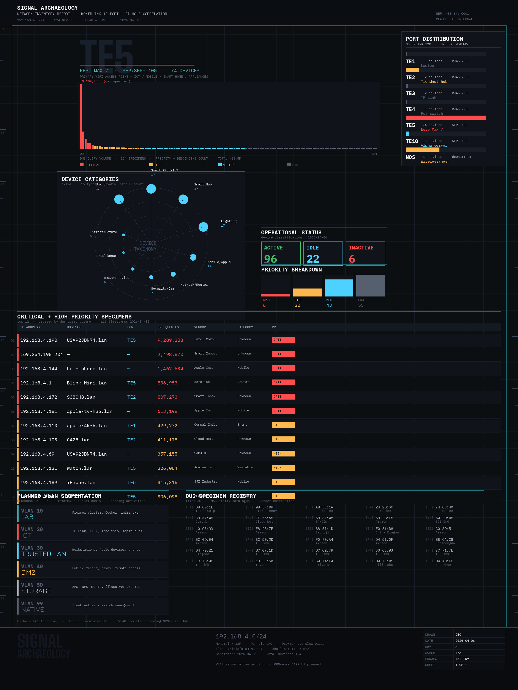
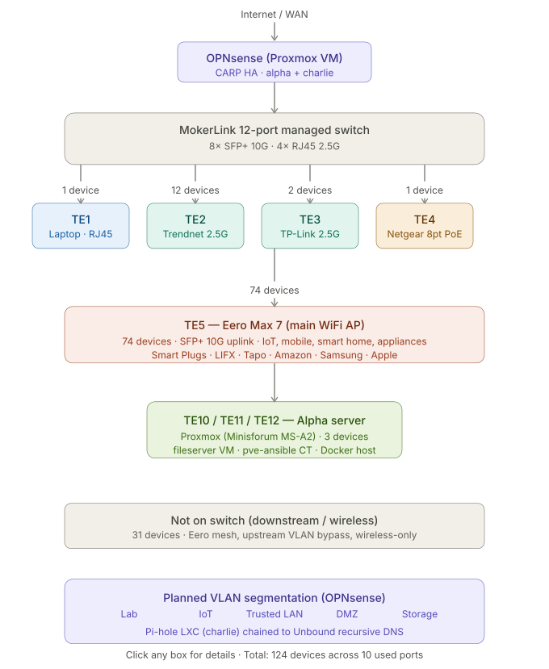

# Network Signal Archaeology

A full-network inventory report for the `192.168.4.0/24` lab segment, correlating the MOKERLINK 12-port managed switch with Pi-hole DNS query data. Rendered 2026-04-06. Reference `NET-INV-0001`.

## What it shows

- **124 devices** across the segment — 96 active, 22 idle, 6 inactive
- **Priority breakdown**: 6 critical, 20 high, 43 medium, 55 low
- **Port distribution** across the MOKERLINK's SFP+/RJ45 ports (TE1–TE10), by device type: laptop, Trendnet hub, TP-Link, PoE switch, the Eero Max 7 wireless AP uplink, and the Alpha/Proxmox uplink (TE10)
- **DNS query volume** per device (~23.5M total queries captured), ranked and colour-coded by priority
- **Top 12 critical/high-priority talkers**, with IP, hostname, switch port, query volume, NIC vendor, and device category
- **Device taxonomy** on a radar chart — 15 categories including IoT, smart hub, mobile/Apple, lighting, security cameras, network/router, appliances
- **OUI specimen registry** — first 30 MAC vendor prefixes seen on the segment
- **Planned VLAN segmentation**: `10` Lab, `20` IoT, `30` Trusted LAN, `40` DMZ, `50` Storage, `99` Native/trunk — not yet live, pending OPNsense CARP HA activation

## Structural topology

The complementary structural view: WAN → OPNsense (CARP HA across `alpha` + `charlie`) → MokerLink switch → each port's device population, plus the 31 devices that sit downstream of the Eero mesh rather than directly on the switch. `alpha` is the Minisforum MS-A2 running Proxmox (fileserver VM, pve-ansible CT, Docker host); `charlie` is the GMKtec K12 running the Pi-hole LXC, chained to Unbound for recursive DNS.

## Data lineage

!!! note "How this gets built"
    1. Discovery scripts capture raw state from each host (`nmap -sn`, `arp`, `pve interfaces`, Pi-hole DHCP/DNS config) — see `/srv/artifacts/dhcp-discovery/`.
    2. That raw output is distilled into `docs/inventory/cut sheet.xlsx` — the structured device/port/vendor cut sheet.
    3. The cut sheet is rendered into this report.

    The same underlying inventory also powers the live, filterable dashboard at
    [jcasnellie69.github.io/network-inventory](https://jcasnellie69.github.io/network-inventory/).

## Design language: "Signal Archaeology"

The visual style is deliberate, not decorative — a field-notation aesthetic borrowed from scientific specimen documentation and technical schematics:

> Every network is a civilization in miniature — nodes as settlements, traffic as commerce, silence as abandonment. Signal Archaeology treats the unseen logic of digital infrastructure the way a field researcher treats a dig site: with patient documentation, numbered specimens, and the quiet reverence of someone who knows that what appears mundane contains multitudes.
>
> Color is a signal system: warm amber marks critical heat, cool blue-grey marks structural mass, deep obsidian grounds everything. Typography is specimen label, not decoration — mono-spaced, thin, architectural.

The full design brief is kept alongside this page: [`network_signal_philosophy.md`](https://github.com/jcasnellie69/homelab-config/blob/main/docs/network_signal_philosophy.md).
